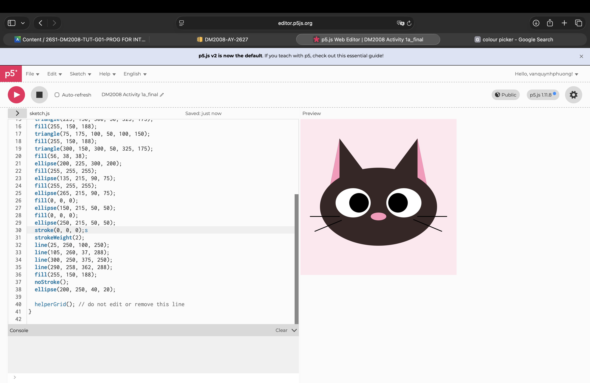
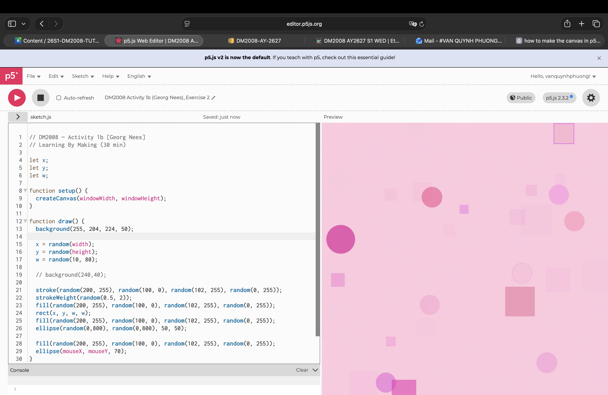

# Week 1 — Introduction to Creative Coding

---

### Activities

| Activity | What I Made                   |
| -------- | ----------------------------- |
| `1a`     | I created a dark brown cat! She is a really symmetrical one so it’s quite easy to create. |
| `1b`     | I created a quite pop and funky interactive space, where it randomly generates shapes with different colours and transparency, with a rows of ellipses following my cursor. |

---

### This Week

In summary, I have learnt general set up of p5.js, some basic shapes and their styling, a few simple animation/interaction, variables, randomness. 

---

### Output

---

### 1a — Simple Creatures   
 
This is just a really cute dark brown cat, which is on the way to bring me an A in Program for Interaction module (Kapi plz).

---

### 1b — Learning by Making  
  
I'm really drawn into the randomness! I used the random() function to randomly generate positions, transparency and sizes for rectangles and ellipses, with an ellipse following the user's cursor (mouseX, mouseY). Overall, it created dynamic visual effects. The colour palette that I chose is a very vibrant, neon-ish pinks, so it looks quite pop and funky!!