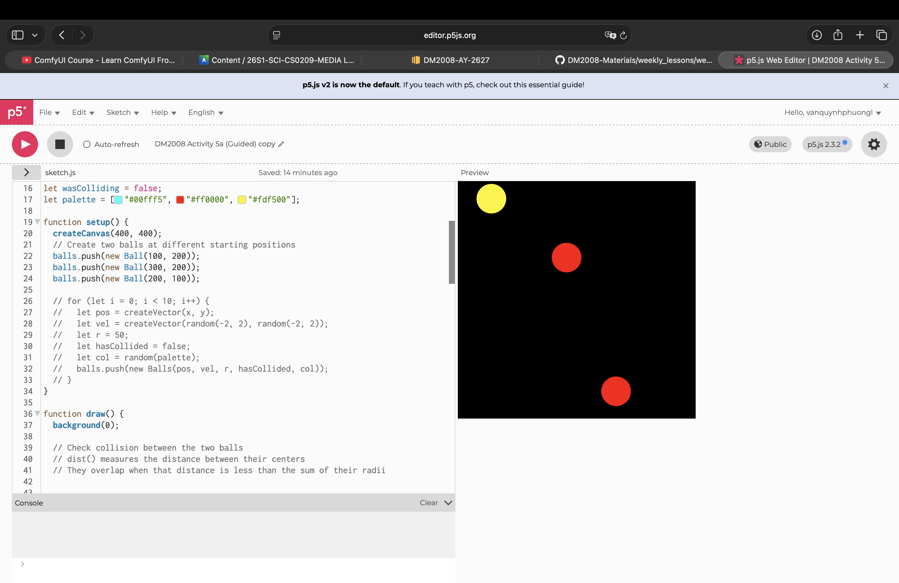
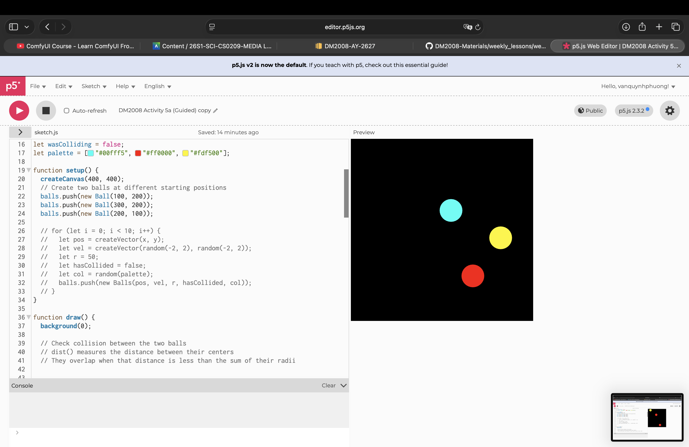

# Week 5 — Object-oriented Programming (Part 2)

---

### Activities

| Activity | What I Made                   |
| -------- | ----------------------------- |
| `5a`     | I created a dark brown cat! She is a really symmetrical one so it’s quite easy to create. |

---

### This Week

This week, I learnt about collisions, vectors, state management: boolean variebles (the true/false), and a bit of game logic. 

---

### Output

---

### 5a — Colliding Circles  

   
In this code, I created 3 circles, which will change colour when colliding with each other.

This is the last weekly coding exercise, so i spent a bit more time on this. One of the most difficult part of this code is to keep the colour of the balls after colliding, which was solved by a boolean variable. I did experience with some different actions, like double the size of the balls after colliding, but this is the final look that I was satisfied with.

---

### ❓ Questions I'm Sitting With

I will come back and try to make more balls rendering when colliding. I did try to deliver that but it didn't really work. Maybe after a few more attempt with coding, I'll be able to deliver that out!