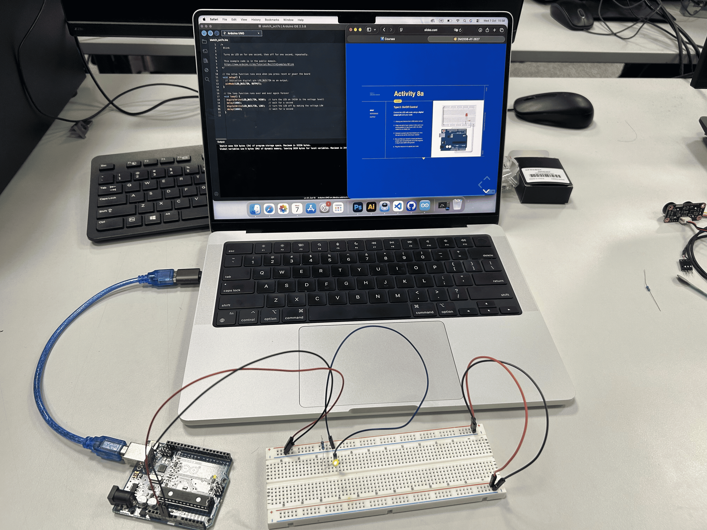
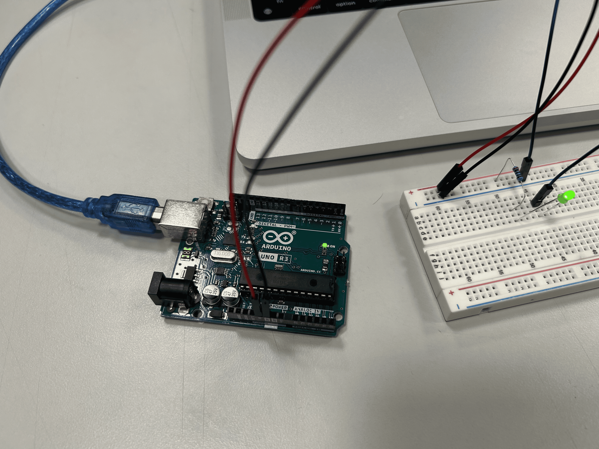
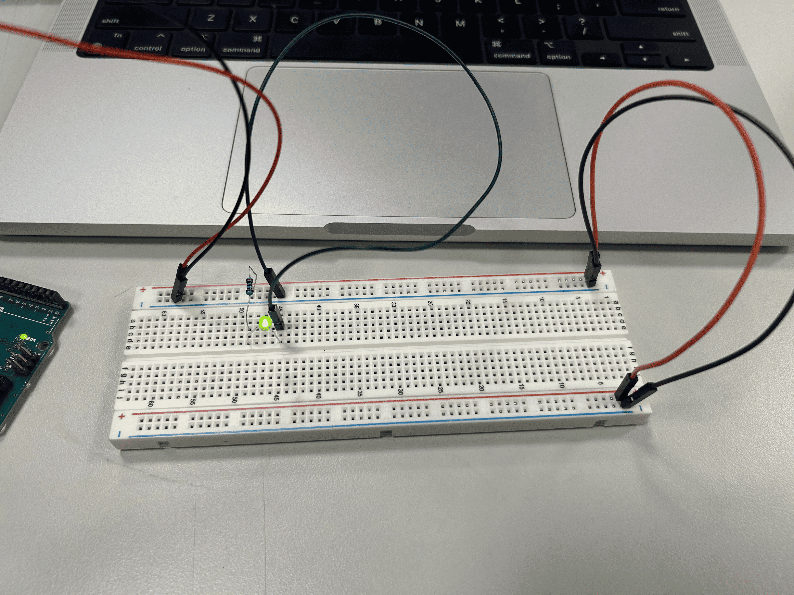
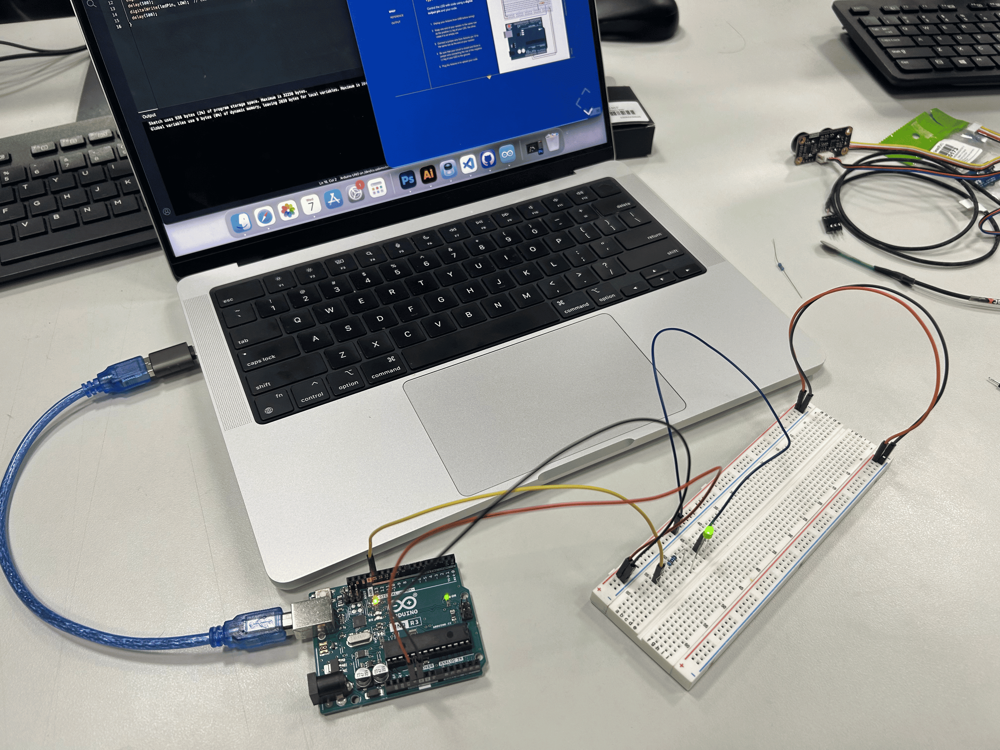
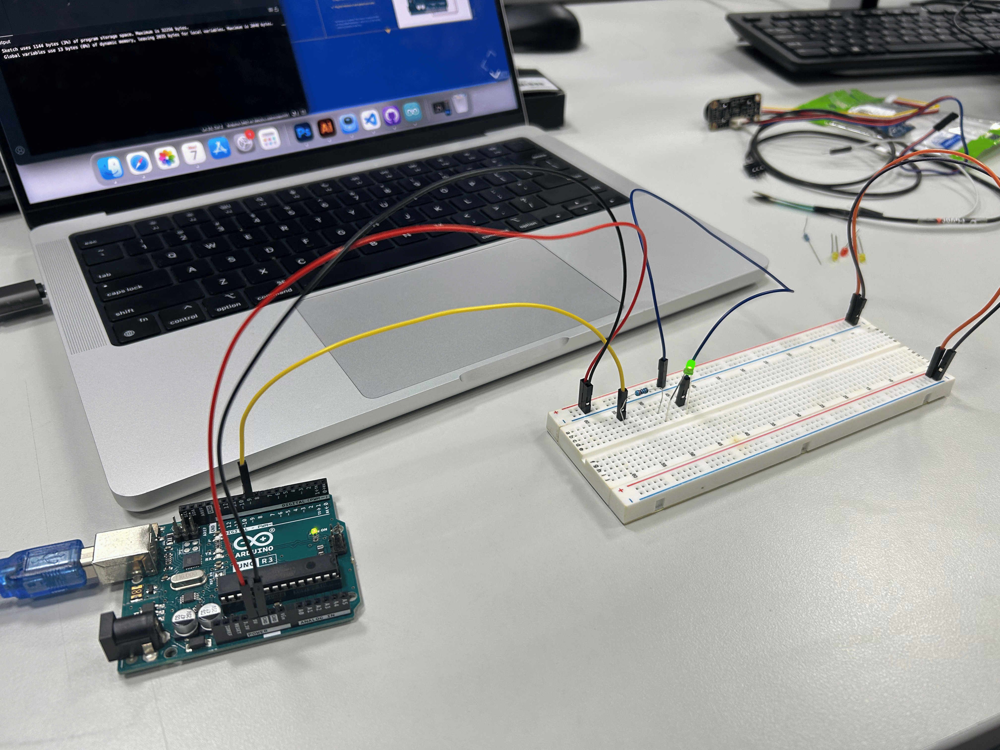
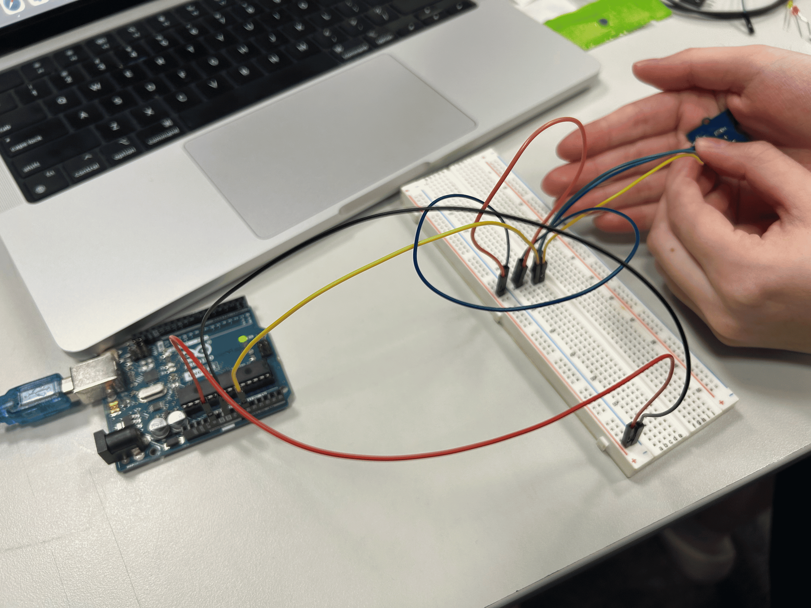
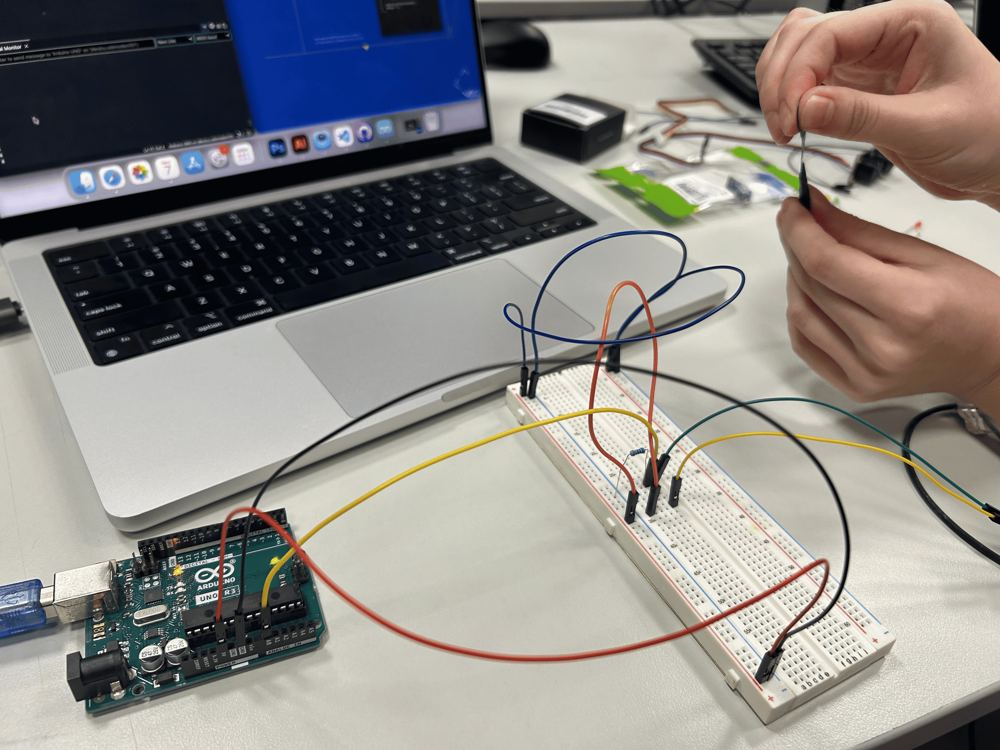
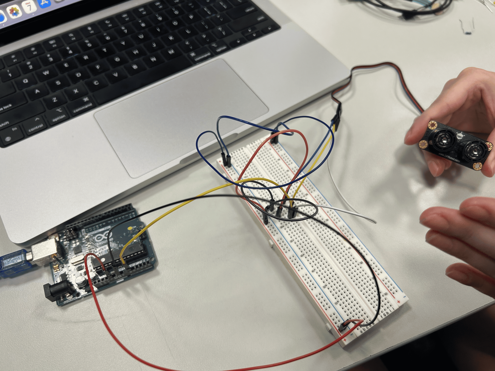

# Week 8 — Arduino Basics

---

### Activities

| Activity | What I Made                   |
| -------- | ----------------------------- |
| `8a-type1` | This arduino program stays turning on when powered. |
| `8a-type2` | This arduino program keeps blinking on when powered. |
| `8a-type3` | This arduino program fades in and out on when powered. |
| `8a-combinationChallenge` | This arduino program has one LED that fades in and out, and one LED that blinks with rhythm. |
| `8b-type1` | This arduino program reads light levels from a phototransistor sensor. |
| `8b-type2` | This arduino program reads the force on the sensor. |
| `8b-type3` | This arduino program reads the distance between things and the sensor. |

---

### This Week

In summary, I have learnt basic set up of arduino, of arduino IDE, and the differences in coding in p5js and arduino IDE. 

---

### Output

---

### 8a-type1 — Always On   

I feel like this is a helpful introductory example of how to create an arduino board, and to verify that the board is working properly. This is the first time I looked at the flow of an arduino, and tried to make sense of it, like which way the power is going, how it works, which node is for which. Generally I think it was quite a fun experience, because I already know how it should look like (I think I did a same/similar one last semester) but only now that I understand it! 

---

### 8a-type2 — On/Off Control 

 
This was quite fun when we tried to change the delay() and it was flashing! At one point we were joking that it is going to explode if we keep it like that!

---

### 8a-type3 — Fade Control

When the brightness reaches the maximum threshold (255) or minimum threshold (0), the code reverses the fadeAmount direction to create a continuous fading in and fading out effect. I haven't done this kind of effect before so I think it's quite interesting.

---

### 8a - Combination Challenge

We have created an Arduino system that includes one LED that fades in and out gradually, and one LED that blinks with rhythm. It was quite fun to create this, as we were able to combine different concepts we learnt in class into one system!

---
### 8b-type1 - Phototransistor Sensor

I haven't tried this sensor before, but it was quite fun to experiment with this! This Arduino code reads light levels from a phototransistor sensor via analog pin A0 and prints the values every 100 milliseconds.

---

### 8b-type2 - Force Sensor

The force sensor measures how much pressure you apply. The harder you press, the higher the number it sends. The number given when we applied force was not so prominent, but I think this could probably be improved by some small changes in the code!

---

### 8b-type3 - Ultrasonic Sensor

This code makes the Arduino measure distance using the ultrasonic sensor’s sound pulse. It reads an analog ultrasonic sensor on pin A0, converts the raw reading into centimeters, clamps between 2 cm and 500 cm, and prints the distance to the Serial Monitor.

--- 

### ❓ Questions I'm Sitting With

When we were doing exercise '8a - Combination Challenge', the fading LED was a bit too slow. Because the code reads from top to bottom, so the delay for the blink LED also influences the delay for the fading effect. I would love to learn more about prevent this later!